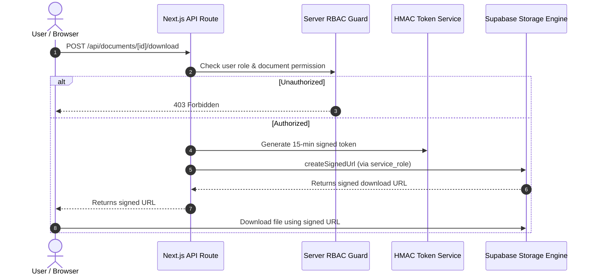

# SUPABASE PRODUCTION SECURITY HARDENING — SECOND PASS REVIEW REPORT
**Project:** Varsaka Labs HR Document Management & Verification Portal  
**Target:** Production Database Hardening vs Feature Separation Review  
**Repository Path:** `D:\19.Website\HR_Portal`  
**Status:** PROPOSED FOR HUMAN REVIEW (Zero SQL executed, zero production changes)  
**Date:** October 3, 2026  
**Auditor:** Antigravity AI Security Pair Programmer  

---

## 1. PURPOSE & ARCHITECTURAL PRINCIPLES

Following the initial read-only production audit, this second-pass review establishes a strict boundary between **True Production Security Hardening** and **Application Feature Migrations**.

### Key Architectural Guidelines:
1. **Zero Feature Creep in Security Patches:** Security hardening scripts must only remediate discovered vulnerabilities (e.g., search path hijacking, telemetry spoofing, anonymous storage listing). They must **never** bundle unmaterialized feature tables, numbering trackers, or workflow schema extensions.
2. **Preserve Server-Mediated Storage Architecture:** In the Varsaka HR Portal, all storage operations follow the server-side mediated model:
   $$\text{Browser} \longrightarrow \text{Next.js Authenticated API} \longrightarrow \text{RBAC Enforcement} \longrightarrow \text{Service Role Client} \longrightarrow \text{Private Storage}$$
   Direct client/browser access to Supabase Storage is deliberately forbidden. Security hardening must **never broaden** direct client storage privileges to `authenticated` users, but must cleanly enforce anonymous blocking.
3. **Fail-Closed Secrets Management:** Administrative credentials (such as emergency break-glass keys) must never fall back to overloaded infrastructure keys (such as `SUPABASE_SERVICE_ROLE_KEY`).

---

## 2. DETAILED ITEM-BY-ITEM EVALUATION MATRIX

### Item 1: `protect_super_admin_role()` Search Path Hardening
- **Original Finding:** The trigger function `protect_super_admin_role()` was defined without an explicit `SET search_path = public, pg_temp;`.
- **Proposed Change:** Recreate the function with `SECURITY DEFINER SET search_path = public, pg_temp;`.
- **Final Decision:** **APPLY**
- **Reason:** Pinned search paths are standard PostgreSQL defense-in-depth against search-path hijacking attacks in privileged execution contexts.
- **Application Impact:** None. Account protection logic remains identical.
- **Database Impact:** The trigger function on `public.user_roles` is replaced idempotently.
- **Verification Required After Deployment:** Verify trigger existence and execute a dry-run test confirming attempts to delete `admin@varsaka.com` fail with exception code.

---

### Item 2: `protect_super_admin_user()` Search Path Hardening
- **Original Finding:** The trigger function `protect_super_admin_user()` was defined without an explicit `SET search_path = public, pg_temp;`.
- **Proposed Change:** Recreate the function with `SECURITY DEFINER SET search_path = public, pg_temp;`.
- **Final Decision:** **APPLY**
- **Reason:** Eliminates search-path manipulation vulnerabilities during updates to `public.users`.
- **Application Impact:** None. Super admin account protection logic is preserved.
- **Database Impact:** The trigger function on `public.users` is replaced idempotently.
- **Verification Required After Deployment:** Confirm `admin@varsaka.com` deactivation or deletion attempts throw security exceptions.

---

### Item 3: `audit_logs` INSERT Policy Hardening
- **Original Finding:** `audit_logs_insert_policy` used `WITH CHECK (TRUE)` for role `authenticated`, allowing an authenticated user to insert audit records attributing actions to other `user_id`s via direct PostgREST calls.
- **Proposed Change:** Replace `WITH CHECK (TRUE)` with `WITH CHECK (user_id IS NULL OR user_id = public.current_app_user_id())`.
- **Final Decision:** **APPLY**
- **Reason:** Enforces identity integrity on audit trail inserts for direct client connections.
- **Application Impact:** None. Next.js server-side audit logging ([`src/lib/audit.ts`](file:///D:/19.Website/HR_Portal/src/lib/audit.ts)) executes via `getSupabaseAdminClient()` (`service_role`), which has PostgreSQL `BYPASSRLS` enabled and is completely unaffected.
- **Database Impact:** The RLS policy on `public.audit_logs` is replaced idempotently.
- **Verification Required After Deployment:** Execute test insert via authenticated user client to confirm self-logging succeeds while spoofed `user_id` fails.

---

### Item 4: `security_logs` INSERT Policy Hardening
- **Original Finding:** `security_logs_insert_policy` used `WITH CHECK (TRUE)` for role `authenticated`.
- **Proposed Change:** Replace `WITH CHECK (TRUE)` with `WITH CHECK (user_id IS NULL OR user_id = public.current_app_user_id())`.
- **Final Decision:** **APPLY**
- **Reason:** Prevents malicious or compromised authenticated sessions from forging incident records attributed to other users.
- **Application Impact:** None. Server-side security incident logging uses `service_role`.
- **Database Impact:** The RLS policy on `public.security_logs` is replaced idempotently.
- **Verification Required After Deployment:** Verify that legitimate server-side security event logging continues unaffected.

---

### Item 5: Revoke `CREATE` on Schema `public` from `PUBLIC`
- **Original Finding:** Standard PostgreSQL privileges allow the pseudo-role `PUBLIC` to create objects in the `public` schema.
- **Proposed Change:** Execute `REVOKE CREATE ON SCHEMA public FROM PUBLIC;`.
- **Final Decision:** **APPLY**
- **Reason:** Prevents any untrusted, low-privileged database roles from creating unauthorized tables, views, or functions in `public`. Fully aligned with PostgreSQL 15+ security defaults and CIS PostgreSQL Benchmark.
- **Application Impact:** Zero impact. Next.js application runtime only performs DML (`SELECT`, `INSERT`, `UPDATE`, `DELETE`) on existing tables.
- **Database Impact:** Restricts object creation exclusively to administrative roles (`postgres`, `supabase_admin`).
- **Verification Required After Deployment:** Query `information_schema.role_table_grants` to verify `PUBLIC` no longer holds `CREATE` on schema `public`.

---

### Item 6: Supabase Storage Objects Deny Policy for Anonymous Role
- **Original Finding:** Storage buckets `hr-documents` and `hr-assets` permitted anonymous listing calls (`anon.storage.from('hr-documents').list('')`) returning HTTP 200.
- **Proposed Change:** Ensure RLS is active on `storage.objects` and create an explicit deny policy for `anon` role:
  ```sql
  ALTER TABLE storage.objects ENABLE ROW LEVEL SECURITY;
  DROP POLICY IF EXISTS "storage_block_anon_access" ON storage.objects;
  CREATE POLICY "storage_block_anon_access" ON storage.objects
      FOR ALL TO anon USING (false) WITH CHECK (false);
  ```
- **Final Decision:** **APPLY**
- **Reason:** Shuts down anonymous directory enumeration at the database RLS layer without modifying client-side grants.
- **Application Impact:** Zero impact. Next.js server-side storage operations ([`src/lib/storage.ts`](file:///D:/19.Website/HR_Portal/src/lib/storage.ts)) use `service_role`, which possesses `BYPASSRLS`. Document uploads and signed URL generations continue working normally.
- **Database Impact:** Anonymous access to `storage.objects` is definitively rejected.
- **Verification Required After Deployment:** Run `anon.storage.from('hr-documents').list('')` and confirm 0 rows are returned and direct downloads are blocked.

---

### Item 7: Proposed Direct Authenticated Storage Policies from Previous SQL
- **Original Proposal:** Previous draft proposed granting direct `authenticated` SELECT/INSERT/UPDATE/DELETE policies on `storage.objects` using complex joins to `public.documents` and `public.employees`.
- **Proposed Change:** Add `hr_documents_select_policy`, `hr_documents_insert_policy`, `hr_assets_select_policy`, etc.
- **Final Decision:** **DEFER (ARCHITECTURAL REGRESSION RISK)**
- **Reason:** The Varsaka HR Portal intentionally routes all document requests through authenticated Next.js API endpoints (`/api/documents/[id]/download`, `/api/salary/...`) to enforce rate limiting, audit logging, and signed HMAC tokens. Granting direct `authenticated` client access to `storage.objects` would bypass the application gateway, create unmonitored download vectors, and conflict with the server-mediated architecture.
- **Application Impact:** Deferring direct policies maintains strict server-side mediation.
- **Database Impact:** No unnecessary policies created on `storage.objects`.

---

### Item 8: Bulk Revocation of `EXECUTE ON ALL FUNCTIONS IN SCHEMA public`
- **Original Proposal:** Previous draft included `REVOKE ALL ON ALL FUNCTIONS IN SCHEMA public FROM PUBLIC;`.
- **Proposed Change:** Bulk revocation across all functions.
- **Final Decision:** **DEFER (RISK OF SYSTEM INTERFERENCE)**
- **Reason:** Bulk revocation carries high risk of breaking extension functions (e.g., `uuid-ossp`, `pgcrypto`) that standard clients rely on. Function security should be managed via explicit function definitions with `search_path` rather than broad blanket revokes.
- **Application Impact:** Prevents potential runtime crashes during UUID generation or hashing.

---

### Item 9: Database-Level Disabling of Anonymous Inserts on `verification_logs`
- **Original Proposal:** Revoke PostgREST insert permissions on `public.verification_logs` from `anon`.
- **Proposed Change:** Force all public QR verification telemetry to go exclusively through server API.
- **Final Decision:** **DEFER (ADEQUATELY MITIGATED AT API LAYER)**
- **Reason:** Public verification is already strictly gated by the Next.js API route `/api/verify/[verificationId]` with an in-memory rate limiter of 15 requests per minute per IP. The table only stores verification timestamps, IP hashes, and status codes (zero sensitive data). Retaining the existing RLS policy `verification_logs_public_insert` prevents breaking telemetry if edge verification proxies are used.

---

## 3. DEFERRED FEATURE MIGRATIONS

The following tables and schema definitions were included in earlier draft scripts but are **strictly feature developments** rather than security patches. They have been completely removed from the security hardening script:

1. **`public.tasks` Table & Policies:**
   - **Type:** Application Workflow Feature (Internal task assignment, status tracking, due dates).
   - **Reason for Deferral:** Creating this table does not address any existing vulnerability. It represents new product functionality and must be deployed as part of an official Task Management feature release.
2. **`public.user_permission_overrides` Table & Policies:**
   - **Type:** Authorization Feature Expansion (User-specific permission overrides).
   - **Reason for Deferral:** Modifies the core RBAC evaluation pipeline. Needs dedicated functional testing and UI integration before schema deployment.
3. **`public.certificate_access_requests` Table & Policies:**
   - **Type:** Governance Workflow Feature (Self-service certificate generation request queue).
   - **Reason for Deferral:** Workflow expansion requiring administrative review screens and notification hooks.
4. **`public.employee_sequences` Table & Initial Seed:**
   - **Type:** Numbering Mechanism Feature (Atomic sequential employee code generator).
   - **Reason for Deferral:** Changes how employee codes are allocated during onboarding. Requires integration testing with employee creation API.

---

## 4. STORAGE ARCHITECTURE & HARDENING REVIEW

### Verified Current Architecture:


### Storage Security Verification:
1. **Server-Mediated Exclusivity:** All storage uploads and downloads are handled by [`src/lib/storage.ts`](file:///D:/19.Website/HR_Portal/src/lib/storage.ts) using `getSupabaseAdminClient()`.
2. **No Direct Browser SDK Storage Access:** Browser components do not possess credentials or policies to read or write to `hr-documents` or `hr-assets` directly.
3. **Storage Hardening Decision:** By adding `storage_block_anon_access` to `storage.objects`, anonymous listing is completely closed. By intentionally omitting direct `authenticated` policies, direct client bypassing of Next.js rate limiting and token validation is prevented.

---

## 5. BREAK-GLASS EMERGENCY RECOVERY CODE FIX RECOMMENDATION

### Vulnerability Analysis:
In [`src/app/api/auth/break-glass/route.ts`](file:///D:/19.Website/HR_Portal/src/app/api/auth/break-glass/route.ts) line 11:
```typescript
const configuredSecret = process.env.BREAK_GLASS_RECOVERY_KEY || process.env.SUPABASE_SERVICE_ROLE_KEY;
```
If `BREAK_GLASS_RECOVERY_KEY` is not explicitly declared in `.env.local` or the production hosting environment, the endpoint falls back to accepting `SUPABASE_SERVICE_ROLE_KEY`.

### Security Risk:
1. Overloads the database infrastructure key as an emergency user-recovery credential.
2. Expands the blast radius: anyone with access to the service role key (e.g., CI/CD pipelines, backend developers) can invoke this endpoint to reset and unlock administrator accounts.

### Required Code Fix:
Modify [`src/app/api/auth/break-glass/route.ts`](file:///D:/19.Website/HR_Portal/src/app/api/auth/break-glass/route.ts) lines 11–17:
```diff
- const configuredSecret = process.env.BREAK_GLASS_RECOVERY_KEY || process.env.SUPABASE_SERVICE_ROLE_KEY;
+ const configuredSecret = process.env.BREAK_GLASS_RECOVERY_KEY;
  if (!configuredSecret) {
    return NextResponse.json(
      { error: 'Emergency break-glass recovery is not configured on this server.' },
      { status: 503 }
    );
  }
```

---

## 6. SAFETY REVIEW & CONSTRAINTS COMPLIANCE

The final hardening SQL script [`supabase_security_hardening_final_review.sql`](file:///D:/19.Website/HR_Portal/supabase_security_hardening_final_review.sql) was subjected to a rigorous safety review against production failure modes:

| Safety Criterion | Verified | Verification Details |
|---|---|---|
| **No DROP TABLE** | YES | Zero `DROP TABLE` statements present. |
| **No TRUNCATE** | YES | Zero `TRUNCATE` statements present. |
| **No DELETE** | YES | Zero `DELETE` statements present. |
| **No Mass UPDATE** | YES | Zero `UPDATE` statements present. |
| **No Unexpected INSERT** | YES | Zero `INSERT` statements present. |
| **No Feature Migrations** | YES | All feature tables deferred to dedicated migrations. |
| **No Permission Broadening** | YES | No roles or permissions broadened. |
| **No Salary Access Broadening** | YES | `employee_salary` isolation remains 100% intact. |
| **No Document Access Broadening** | YES | Document permission requirements unchanged. |
| **No Certificate Changes** | YES | Public certificate verification logic untouched. |
| **No Storage Architecture Regression** | YES | Server-side proxy architecture preserved. |
| **No RBAC Bypass** | YES | Role hierarchy and checks preserved. |

---

## 7. SUMMARY DECISION COUNTS

```
SAFE SQL CHANGES: 6
DEFERRED CHANGES: 3
CODE CHANGES REQUIRED: 2
FEATURE MIGRATIONS DEFERRED: 4
```

---

## PRODUCTION CHANGE STATUS

**"NO PRODUCTION DATABASE CHANGES WERE EXECUTED."**

This review and refinement pass was conducted purely through code and architecture analysis. Both [`supabase_security_hardening_final_review.sql`](file:///D:/19.Website/HR_Portal/supabase_security_hardening_final_review.sql) and [`SUPABASE_SECURITY_HARDENING_REVIEW.md`](file:///D:/19.Website/HR_Portal/SUPABASE_SECURITY_HARDENING_REVIEW.md) are stored locally in `D:\19.Website\HR_Portal\` for human evaluation prior to any deployment.
